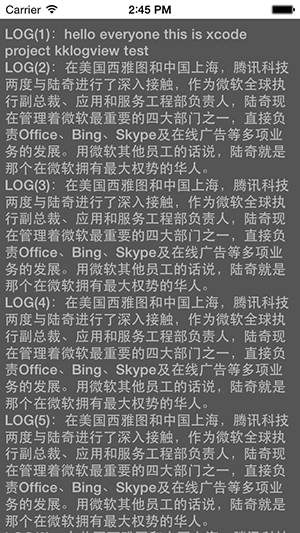

KKLogView
=========

一个打印日志的view组件；the view for printing log info



### 如何使用
1. 导入 `KKLogView.h` , `KKLogView.m`
2. 在使用的地方，#import `KKLogView.h`
3. 初始化  `    KKLogView *logView = [[KKLogView alloc]initWithController:self];
`
4. 配置高度 `logView.height = 300;`
5. 打印日志 ： `[logView printLog:@"hello world"];
`

### 可用的api

```objective-c
/**
 *  日志显示TextView
 */
@property (nonatomic,strong,readonly)UITextView *theTextView;

/**
 *  日志信息
 */
@property (nonatomic,strong,readonly)NSMutableString *logMessage;

/**
 *  设置logView的高度 默认的高度是 屏幕显示的高度
 */
@property (nonatomic,assign)CGFloat height;

/**
 *  加载logView到指定视图
 *
 *  @param aController 指定视图控制器
 *
 *  @return 返回logView对象
 */
- (id)initWithController:(UIViewController *)aController;

/**
 *  添加一条打印日志
 *
 *  @param logStr log日志
 */
- (void)printLog:(NSString *)logStr;

/**
 *  日志写入到文件
 *
 *  @param filePath 日志写入路径加文件名：比如：//Users/user,不加最后一个 / 文件名也不加，默认是 日期加.txt 例如：2014_04_19-14_25_49.txt
 */
- (void)writeLogToFile:(NSString *)filePath;

/**
 *  删除logView;
 */
- (void)removeLogView;

```

### demo

```objective-c
- (void)viewDidLoad
{
    [super viewDidLoad];
    
    KKLogView *logView = [[KKLogView alloc]initWithController:self];
    logView.tag = 110;
    [logView printLog:@"hello everyone this is xcode project kklogview test"];
    [NSTimer scheduledTimerWithTimeInterval:2.0f target:self selector:@selector(doPrint) userInfo:nil repeats:YES];
    NSLog(@"%@",NSStringFromCGRect(self.view.bounds));
    
    
}

- (void)doPrint
{
    KKLogView *logView = (KKLogView *)[self.view viewWithTag:110];

    static int count = 0;
    count +=1;
    
    if (count>5) {
        return;
    }
    if (count==5) {
        [logView writeLogToFile:@"/Users/user/Desktop"];
    }
    
    [logView printLog:@"在美国西雅图和中国上海，腾讯科技两度与陆奇进行了深入接触，作为微软全球执行副总裁、应用和服务工程部负责人，陆奇现在管理着微软最重要的四大部门之一，直接负责Office、Bing、Skype及在线广告等多项业务的发展。用微软其他员工的话说，陆奇就是那个在微软拥有最大权势的华人。"];
    
    // [logView removeLogView];
}

```

### 反馈

`dev.keke@gmail.com`


