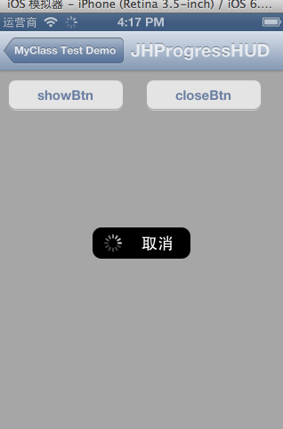
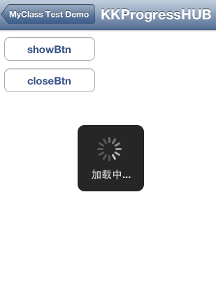

MyClassTest
===========

自已封装的一些iOS开发中常用工具，比如网络请求，text,hud等，写的比较粗糙，欢迎指正！

### 包括内容

+ #### 仿交通银行iOS客户端的网络请求hud

+ #### 基本的网络请求HUD

+ #### 文本提示HUD

### 关于
- 项目不定期更新
- 如有问题欢迎指正
- `dev.keke@gmail.com`